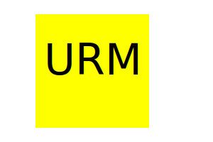
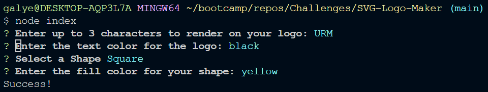

# SVG Logo Maker

## Description

This application will help to automate the process of generating a basic logo with the choice of three basic shapes, circle, square, and triangle. The user can customize the color of the shape and text color.

## Table of Contents

- [Installation](#installation)
- [Usage](#usage)
- [Contributing](#contributing)
- [Tests](#tests)
- [License](#license)
- [Questions](#questions)

## Installation

Install Inquirer v8.2.4 and Jest by running npm i after cloning the repo to your local IDE.

## Usage

The user will open the main folder in the terminal. Then, enter "node index" into the terminal. Answer the questions accurately, while remembering to only use up to three characters for your logo text. The fill and text colors use color keywords. After answering the prompts, check the dist folder for your newly generated "logo.SVG" file.

### Screenshot and Walkthrough

[Walkthrough Video](undefined)

#### SVG Screenshot Preview

#### Terminal Screenshot

## Contributing

Contributions and suggestions are welcome. Please fork the repo and commit any changes you believe will help improve this application.

## Tests

In the terminal, after installing jest, enter "npm run test" to check for any errors.

## License

**Note: This application is covered under the MIT License.**

## Questions

How to contact me with questions:
[galyenb@vcu.edu](galyenb@vcu.edu)
